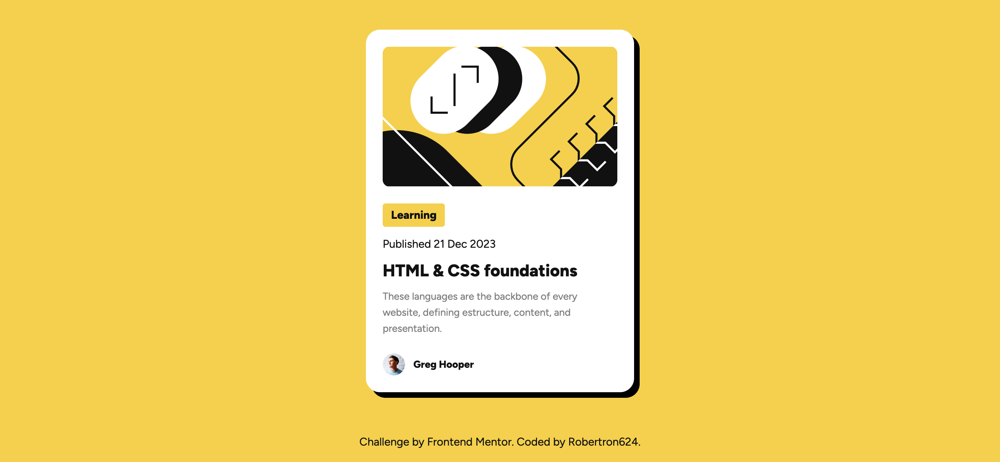

# Frontend Mentor - Blog preview card solution

This is a solution to the [Blog preview card challenge on Frontend Mentor](https://www.frontendmentor.io/challenges/blog-preview-card-ckPaj01IcS). Frontend Mentor challenges help you improve your coding skills by building realistic projects. 

## Table of contents

- [Overview](#overview)
  - [The challenge](#the-challenge)
  - [Screenshot](#screenshot)
  - [Links](#links)
- [My process](#my-process)
  - [Built with](#built-with)
  - [What I learned](#what-i-learned)
  - [Continued development](#continued-development)
- [Author](#author)

## Overview

### The challenge

Users should be able to:

- See hover and focus states for all interactive elements on the page

### Screenshot



### Links

- Solution URL: [Github repo](https://github.com/Robertron624/blog-preview-card-project)
- Live Site URL: [Live Site](https://robert-fm-blog-card.netlify.app/)

## My process

### Built with

- Semantic HTML5 markup
- CSS custom properties
- Flexbox
- Mobile-first workflow

**Note: These are just examples. Delete this note and replace the list above with your own choices**

### What I learned

Not much, since It was a fairly easy challenge. I did learn that the frontendmentor preview screenshot does not support
css nestiong, so I had to remove the nesting in the css file.

```css
/* Before */
.card {
    .card__image {
        ...
    }
}

/* After */
.card {
    ...
}

.card__image {
    ...
}
```

### Continued development

Fairly easy challenge, but I need to work on my CSS skills.

## Author

- Website - [Robert Ramirez](https://www.robert-ramirez.co)
- Frontend Mentor - [@Robertron624](https://frontendmentor.io/profile/Robertron624)
